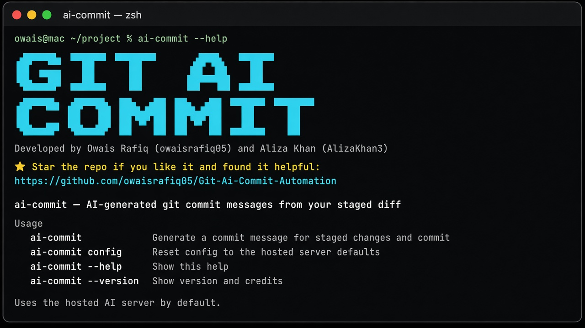
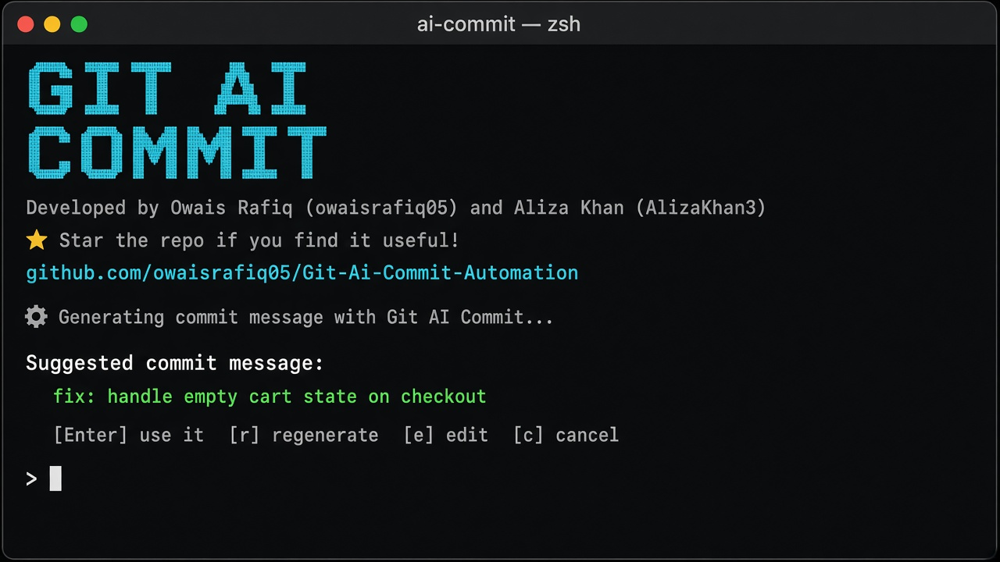

# Git AI Commit Automation

**AI-powered git commit messages from your staged diff — one command, zero model downloads on your laptop.**

[](https://www.npmjs.com/package/@owaisrafiq05/git-ai-commit)
[](https://opensource.org/licenses/MIT)
[](https://nodejs.org/)

```bash
git add .
ai-commit
```

<p align="center">
  
</p>

<p align="center">
  
</p>

Star this repo if it helps you:  
**https://github.com/owaisrafiq05/Git-Ai-Commit-Automation**

---

## Why this exists

Writing good commit messages takes time. Local LLMs mean multi‑GB downloads and a background process. Cloud API keys mean rate limits and setup friction.

**Git AI Commit** gives you a tiny CLI that:

1. Reads only your **staged diff** (never your whole repo)
2. Sends it to a **hosted AI backend** (Ollama on a server you or the maintainers run)
3. Suggests a conventional commit message
4. Lets you **accept / regenerate / edit / cancel**
5. Runs `git commit` for you

No Ollama install on the user’s machine. No 2GB model download. Just Node.js and one command.

---

## Quick start (end users)

### Requirements

- [Node.js](https://nodejs.org/) **18+**
- A git repository with staged changes

### Install

```bash
npm install -g @owaisrafiq05/git-ai-commit
```

If you hit permission errors on macOS/Linux, use a user prefix (recommended):

```bash
mkdir -p ~/.npm-global
npm config set prefix ~/.npm-global
echo 'export PATH="$HOME/.npm-global/bin:$PATH"' >> ~/.zshrc
source ~/.zshrc
npm install -g @owaisrafiq05/git-ai-commit
```

Or run without a global install:

```bash
npx @owaisrafiq05/git-ai-commit
```

### Use it

```bash
cd your-project
git add .
ai-commit
```

You’ll see the branded **GIT AI COMMIT** banner, then a suggested message:

```text
Suggested commit message:

  fix: handle empty cart state on checkout

[Enter] use it   [r] regenerate   [e] edit   [c] cancel
```

| Key | Action |
|-----|--------|
| **Enter** | Accept and commit |
| **r** | Regenerate |
| **e** | Edit the message, then commit |
| **c** | Cancel |

### Help & version

```bash
ai-commit --help
ai-commit --version
ai-commit config    # reset to hosted defaults
```

Config is stored at `~/.ai-commit/config.json`.

---

## How it works

```text
┌─────────────────────┐         ┌──────────────────────────────┐
│  Your laptop        │         │  Hosted backend (AWS / VM)   │
│                     │         │                              │
│  git add .          │         │  Node proxy  (:3000)         │
│  ai-commit  ───────►│  HTTP   │       │                      │
│                     │         │       ▼                      │
│  review & commit    │◄────────│  Ollama + qwen2.5-coder:3b   │
└─────────────────────┘         └──────────────────────────────┘
```

1. **CLI** (`cli/`) — the npm product users install  
2. **Server** (`server/`) — thin HTTP API that talks to Ollama (or optionally Gemini)  
3. **Docker Compose** — runs proxy + Ollama together on a VM with enough RAM  

Only the staged diff is sent. The model stays on the server.

---

## Repository structure

```text
Git-Ai-Commit-Automation/
├── cli/                 # npm package (@owaisrafiq05/git-ai-commit)
│   ├── bin/             # ai-commit entrypoint
│   ├── src/             # CLI logic, banner, hosted client
│   └── scripts/         # postinstall banner
├── server/              # HTTP proxy (Ollama / Gemini backends)
├── docker-compose.yml   # Ollama + server on one host
├── render.yaml          # optional Render deploy (Gemini proxy mode)
└── .github/workflows/   # keep-alive ping for free-tier hosts
```

---

## Self-hosting the backend

The public CLI points at a hosted server by default. To run **your own** stack (team / private):

### Hardware

| Resource | Minimum | Recommended |
|----------|---------|-------------|
| RAM | 4 GB | **8 GB+** |
| Disk | 20 GB | **30 GB+** |
| OS | Ubuntu 22.04 / 24.04 | — |

`qwen2.5-coder:3b` will **not** fit on a 1 GB free-tier micro instance.

### Deploy with Docker Compose

```bash
git clone https://github.com/owaisrafiq05/Git-Ai-Commit-Automation.git
cd Git-Ai-Commit-Automation

echo "CLIENT_SECRET=$(openssl rand -hex 32)" > .env
cat .env   # save this for your CLI users

docker compose up -d --build
docker compose exec ollama ollama pull qwen2.5-coder:3b

curl -s http://127.0.0.1:3000/health
# {"status":"ok","backend":"ollama",...}
```

Open inbound **TCP 3000** on your firewall / security group.

Point a custom CLI config at your server by editing `~/.ai-commit/config.json`:

```json
{
  "provider": "hosted",
  "hosted": {
    "host": "http://YOUR_SERVER_IP:3000",
    "clientSecret": "YOUR_CLIENT_SECRET"
  }
}
```

### Server environment

| Variable | Description | Default |
|----------|-------------|---------|
| `BACKEND` | `ollama` or `gemini` | `ollama` |
| `OLLAMA_HOST` | Ollama base URL | `http://localhost:11434` |
| `OLLAMA_MODEL` | Model name | `qwen2.5-coder:3b` |
| `CLIENT_SECRET` | Shared secret for `/generate-commit-message` | (empty = open) |
| `PORT` | HTTP port | `3000` |
| `GEMINI_API_KEY` | Only if `BACKEND=gemini` | — |

### API

```http
GET  /health
POST /generate-commit-message
     Header: X-Client-Secret: <secret>
     Body:   { "prompt": "..." }
     →       { "message": "fix: ..." }
```

---

## Local development (CLI)

```bash
git clone https://github.com/owaisrafiq05/Git-Ai-Commit-Automation.git
cd Git-Ai-Commit-Automation/cli
node bin/ai-commit.js --help

# optional: link for local global command
npm link
```

---

## Publishing the CLI (maintainers)

Package name: **`@owaisrafiq05/git-ai-commit`**

```bash
cd cli
npm login
npm publish --access public
```

Bump versions with:

```bash
npm version patch
npm publish --access public
```

---

## Features

- One-command commit message generation from staged diffs  
- Interactive accept / regenerate / edit / cancel flow  
- Hosted AI by default — no local model required for users  
- Branded CLI banner with project credits  
- Self-hostable with Docker Compose + Ollama  
- Optional Gemini backend for lightweight proxy-only hosts  
- MIT licensed and open source  

---

## Roadmap

- [ ] VS Code / Cursor extension wrapping the same CLI flow  
- [ ] HTTPS + domain in front of the hosted API  
- [ ] Rate limiting and abuse controls for the public endpoint  
- [ ] Benchmark smaller models for lower-cost VMs  
- [ ] Multi-language commit message preference  

---

## Contributing

Contributions are welcome.

1. Fork the repo  
2. Create a branch: `git checkout -b feature/your-idea`  
3. Commit your changes (feel free to use `ai-commit` itself)  
4. Open a pull request with a clear description  

Please keep PRs focused and match the existing code style.

---

## Security notes

- The CLI sends **staged diffs only** — avoid staging secrets (`.env`, keys, tokens).  
- Protect public backends with `CLIENT_SECRET` and firewall rules.  
- Self-host if you need diffs to stay inside your network.  

---

## Authors & credits

Built and maintained with care by:

| | |
|--|--|
| **Owais Rafiq** | [@owaisrafiq05](https://github.com/owaisrafiq05) |
| **Aliza Khan** | [@AlizaKhan3](https://github.com/AlizaKhan3) |

If this project saves you time, please **star the repository** — it helps others find it:

**https://github.com/owaisrafiq05/Git-Ai-Commit-Automation**

---

## License

This project is licensed under the [MIT License](LICENSE).

```text
Copyright (c) 2026 Owais Rafiq, Aliza Khan
```

---

## Links

- **GitHub:** https://github.com/owaisrafiq05/Git-Ai-Commit-Automation  
- **npm:** https://www.npmjs.com/package/@owaisrafiq05/git-ai-commit  
- **Issues:** https://github.com/owaisrafiq05/Git-Ai-Commit-Automation/issues  

---

<p align="center">
  <b>Git AI Commit</b> — stage your changes, get a great commit message, ship faster.
  <br />
  Developed by Owais Rafiq (<a href="https://github.com/owaisrafiq05">owaisrafiq05</a>)
  &amp; Aliza Khan (<a href="https://github.com/AlizaKhan3">AlizaKhan3</a>)
</p>
